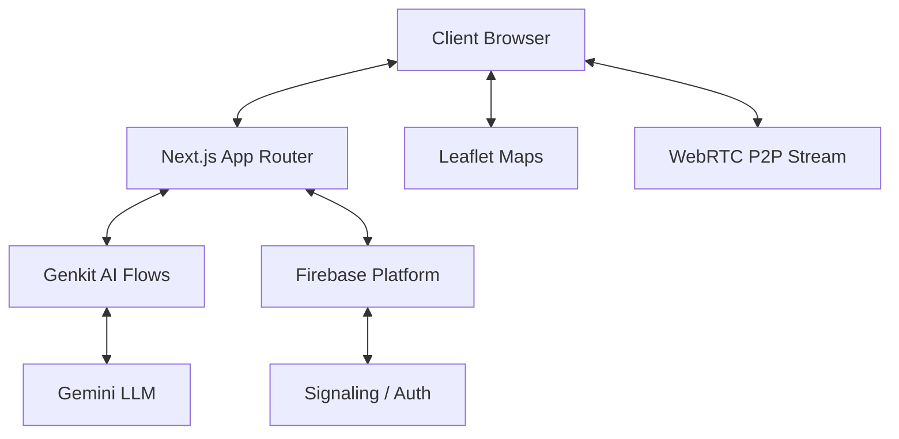

# 🏥 MediConnect: AI-Powered Telemedicine Platform

> **Bridging the Healthcare Gap in Rural and Underserved Communities with Intelligent Technology.**

---


*Empowering patients and providers through seamless, AI-driven digital health services.*

---

## 🌟 Overview

MediConnect is a cutting-edge telemedicine ecosystem designed to provide accessible, intelligent, and reliable healthcare. By leveraging the power of **Generative AI** and **Real-Time Communication**, we've built a platform that simplifies the patient journey—from initial symptom assessment to specialist consultations and chronic care management.

### Our Mission
To democratize healthcare by providing rural communities with the tools they need to connect with top-tier medical expertise, regardless of geographic barriers.

---

## 🚀 Key Features

### 🤖 AI Health Assessor
A multi-step, intelligent triage system. Patients describe their symptoms, upload photos of visible issues (like rashes), and provide vitals.
- **Multimodal Analysis**: Uses Google's Gemini models to analyze both text and images.
- **BMI Calculation**: Integrated weight and height inputs with real-time Body Mass Index calculation.
- **Smart Triage**: Categorizes risk levels (Low, Medium, High, Emergency) and provides cautious recommendations.

### 📅 Intelligent Appointment Scheduler
- **Specialty Recommendation**: AI analyzes symptoms to suggest the most relevant specialist.
- **Seamless Booking**: Real-time calendar interface for scheduling video, chat, or in-person visits.

### 📹 Secure Video Consultations
- **WebRTC Powered**: Direct, peer-to-peer video calls for low-latency, secure consultations.
- **Firebase Signaling**: Uses Firebase Realtime Database to coordinate connections instantly.

### 📄 AI Document Analyzer
- **Prescription & Lab Interpretation**: Upload medical documents and ask specific questions.
- **Clinical Context**: Extracts dosages, warnings, and key findings from complex reports.

### 💊 Digital Medicine Cabinet
- **Medication Management**: Track dosages, schedules, and adherence for chronic conditions.
- **Family Sharing**: Grant trusted family members access to health data for collaborative care.

### 🛠️ Comprehensive Admin Suite
- **User Management**: Role-based access control (RBAC) for Patients, Providers, and Admins.
- **Platform Analytics**: Real-time visualization of user growth and feature engagement.
- **System Health**: Automated test suite and moderation queues to ensure platform integrity.

---

## 🎭 User Roles & Experience

MediConnect provides three distinct, personalized experiences:

| Feature | 👤 Patient | 🩺 Provider | 🔑 Admin |
| :--- | :---: | :---: | :---: |
| **Personal Dashboard** | ✅ | ✅ | ✅ |
| **AI Symptom Analysis** | ✅ | - | - |
| **Manage Patient Queue** | - | ✅ | - |
| **Document Analysis** | ✅ | ✅ | - |
| **Video Consultation** | ✅ | ✅ | - |
| **User & Role MGMT** | - | - | ✅ |
| **Platform Analytics** | - | - | ✅ |

---

## 🛠️ Technology Stack

| Layer | Technology |
| :--- | :--- |
| **Frontend** | [Next.js 15](https://nextjs.org/) (App Router), [React 18](https://reactjs.org/) |
| **Styling** | [Tailwind CSS](https://tailwindcss.com/), [ShadCN UI](https://ui.shadcn.com/) |
| **Artificial Intelligence** | [Google Genkit](https://firebase.google.com/docs/genkit), [Gemini 2.5 Flash](https://deepmind.google/technologies/gemini/) |
| **Real-Time** | [WebRTC](https://webrtc.org/), [Firebase Realtime DB](https://firebase.google.com/docs/database) |
| **Auth** | [Firebase Auth](https://firebase.google.com/docs/auth), [WebAuthn/Passkeys](https://webauthn.io/) |
| **Mapping** | [Leaflet](https://leafletjs.com/), [Nominatim API](https://nominatim.org/) |

---

## 📦 Getting Started

### Prerequisites
- Node.js (v18+)
- A Firebase Project
- A Google AI Studio API Key

### Installation

1.  **Clone the Repository**
    ```bash
    git clone <repository-url>
    cd mediconnect
    ```

2.  **Install Dependencies**
    ```bash
    npm install
    ```

3.  **Environment Setup**
    Create a `.env.local` file:
    ```env
    GEMINI_API_KEY=your_api_key_here
    NEXT_PUBLIC_FIREBASE_API_KEY=...
    # ... other firebase config
    ```

4.  **Run Development Servers**
    ```bash
    # Terminal 1: Start Genkit
    npm run genkit:dev

    # Terminal 2: Start Next.js
    npm run dev
    ```

---

## 🗺️ Project Architecture



---

## 📖 Documentation

Detailed technical guides are available in the `/docs` directory:
- [Authentication Architecture](./docs/authentication/README.md)
- [AI Analyzer Deep Dive](./docs/ai-analyzer/README.md)
- [WebRTC Implementation](./docs/webrtc/README.md)
- [Admin Suite Overview](./docs/admin/README.md)

---

## ⚖️ Disclaimer
*MediConnect's AI features are intended for informational purposes and preliminary triage only. They do not constitute a medical diagnosis. Always consult with a qualified healthcare professional for medical advice.*

---
© 2024 MediConnect Team. Built with ❤️ for better health.