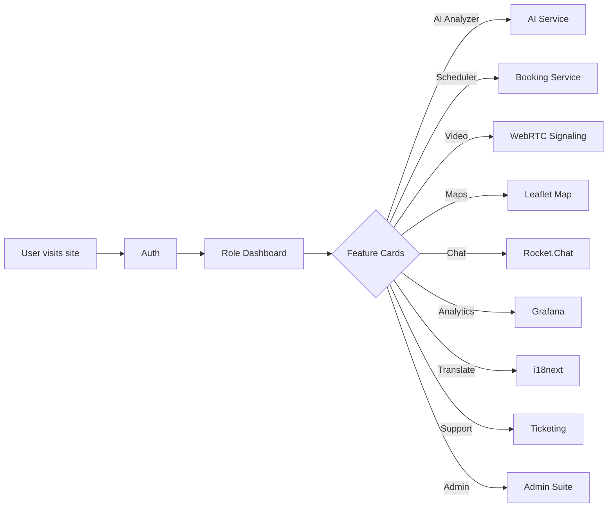

# MediConnect Project Documentation

## Table of Contents
1.  [Introduction](#1-introduction)
2.  [Features Overview](#2-features-overview)
3.  [Technology Stack](#3-technology-stack)
4.  [Flowchart Overview](#4-flowchart-overview)
5.  [Installation & Setup](#5-installation--setup)
6.  [Usage](#6-usage)
7.  [Contributing](#7-contributing)
8.  [License](#8-license)

---

### 1. Introduction
MediConnect is an AI-powered telemedicine platform designed to bridge the healthcare gap in rural and underserved communities. Our mission is to provide accessible, intelligent, and reliable health services by leveraging modern web and AI technologies.

### 2. Features Overview
This section provides a high-level overview of each feature. For detailed documentation, please refer to the individual README files in the `docs` directory.

- **[Authentication](./authentication/README.md)**: Secure, multi-role user registration and login (Patient, Provider, Admin) with OTP and biometric options.
- **[Role-Based Dashboards](./admin/README.md)**: Personalized dashboard views for each user role, providing access to relevant features.
- **[AI Symptom Analyzer](./ai-analyzer/README.md)**: A Genkit-powered tool for preliminary health assessment based on user-described symptoms.
- **[Appointment Scheduler](./scheduler/README.md)**: An intelligent system for finding and booking appointments with healthcare providers.
- **[Video Consultation](./webrtc/README.md)**: Secure, real-time video calls between patients and providers using WebRTC.
- **[Medication Management](./medication/README.md)**: A digital cabinet for users to track their medications, dosages, and schedules.
- **[Emergency Response](./emergency/README.md)**: Tools for location tracking and quick access to emergency contacts in critical situations.
- **[Family Management](./family/README.md)**: Allows patients to grant designated family members access to their health information.
- **[Community Chat](./chat/README.md)**: A secure messaging platform for community support, powered by Rocket.Chat.
- **[Predictive Analytics](./analytics/README.md)**: Visualizes health trends and platform usage data using Grafana/Superset.
- **[Translation](./translation/README.md)**: Multi-language support throughout the application, managed by i18next.
- **[Mapping](./leaflet/README.md)**: Integrates Leaflet for live location tracking and finding nearby services.
- **[Support Ticketing](./support/README.md)**: A system for users to submit and track support requests.
- **[Admin Suite](./admin/README.md)**: A comprehensive set of tools for user management, content moderation, analytics, and system testing.

### 3. Technology Stack
- **WebRTC**: For peer-to-peer, real-time video and audio communication directly in the browser.
- **Leaflet**: A lightweight, open-source library for interactive maps, used for location services.
- **i18next**: A powerful internationalization framework for translating application content into multiple languages.
- **Rocket.Chat**: A scalable, open-source communication platform integrated for secure community chat.
- **Grafana/Superset**: Data visualization tools used to create dashboards for predictive analytics and platform monitoring.
- **Firebase Services**: Utilizes Auth for user management, Firestore for data storage, and Cloud Functions for backend logic.

### 4. Flowchart Overview

### 5. Installation & Setup
1.  **Clone Repo**: `git clone <repository-url>`
2.  **Install Dependencies**: `npm install`
3.  **Configure Environment**: Set up the `dev.nix` file with the required Nix packages and environment variables.
4.  **Enable Firebase Services**: In the Firebase Studio side panel, ensure that Authentication, Firestore, and any other required Firebase services are enabled for your project.

### 6. Usage
-   **Start Development Server**: `npm start`
-   **Run All Tests**: `npm run test:all`
-   **Deploy to Production**: `npm run deploy`

### 7. Contributing
-   **Pull Requests**: Please submit PRs against the `develop` branch. Ensure your code is well-documented.
-   **Code Style**: Follow the existing code style, enforced by Prettier and ESLint.
-   **Testing**: All new features must include corresponding unit and end-to-end tests.

### 8. License
This project is licensed under the MIT License. See the `LICENSE` file for more details.
