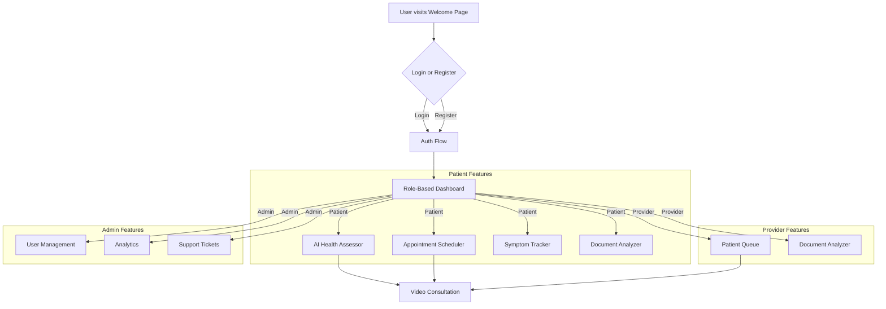

# MediConnect Project Documentation

## 1. Introduction
MediConnect is an AI-powered telemedicine platform designed to bridge the healthcare gap in rural and underserved communities. Our mission is to provide accessible, intelligent, and reliable health services by leveraging a modern web stack and powerful AI technologies. This document serves as the central hub for all project documentation.

## 2. Features Overview
This section provides a high-level overview of each feature. For detailed documentation, please refer to the individual README files in this directory.

- **[Authentication](./authentication/README.md)**: Secure, multi-role user registration and login (Patient, Provider, Admin) with email/password and biometric (WebAuthn) options. Includes accessibility features like text-to-speech for password reset.
- **[Role-Based Dashboards](./admin/README.md)**: Personalized dashboard views for each user role, providing access to relevant features via a card-based navigation system.
- **[AI Symptom Analyzer](./ai-analyzer/README.md)**: A Genkit-powered, multi-step form for preliminary health assessment based on user-described symptoms, pain levels, and optional photo uploads.
- **[Appointment Scheduler](./scheduler/README.md)**: An intelligent system that uses an LLM to recommend suitable doctors based on symptoms and allows users to book appointments.
- **[Video Consultation](./webrtc/README.md)**: Secure, real-time, peer-to-peer video calls between patients and providers using WebRTC, with Firebase Realtime Database for signaling.
- **[Document Analyzer](./document-analyzer/README.md)**: A tool for users to upload medical documents (prescriptions, lab reports) and receive an AI-powered analysis based on their specific questions.
- **[Medication Management](./medication/README.md)**: A "Digital Medicine Cabinet" for users to track their medications, dosages, and schedules.
- **[Emergency Response](./emergency/README.md)**: Integrates live location tracking via Leaflet and provides quick access to emergency contacts directly from the patient dashboard.
- **[Family Management](./family/README.md)**: Allows patients to grant designated family members access to view their health information.
- **[Community Chat](./chat/README.md)**: A placeholder for a future secure messaging platform for community support, conceptually designed to use Rocket.Chat with SSO.
- **[Symptom Tracker](./symptom-tracker/README.md)**: A tool for patients to log daily symptoms, including an optional AI-powered image analysis for visible symptoms.
- **[Translation](./translation/README.md)**: Multi-language support (English, Hindi, German) throughout the application, managed by i18next and integrated with location services for language suggestions.
- **[Mapping](./leaflet/README.md)**: Integrates Leaflet for live location tracking and reverse geocoding to enhance other services like translation.
- **[Support Ticketing](./support/README.md)**: A system for users to submit support requests and for admins to manage them via a dedicated dashboard, using a mock in-memory store.
- **[Admin Suite](./admin/README.md)**: A comprehensive set of tools for user management, platform analytics (mock), content moderation, and a system test suite.

## 3. Technology Stack
The application is built on a modern, performant, and scalable technology stack.

- **Frontend**: Next.js with the App Router, React, and TypeScript.
- **UI**: ShadCN UI components, styled with Tailwind CSS.
- **AI**: Google Genkit, using Gemini models for text analysis, image processing, and text-to-speech.
- **Backend-as-a-Service**: Firebase, primarily for Authentication and the Realtime Database (for WebRTC signaling). Firestore is the conceptual choice for the main database.
- **Real-time Communication**: WebRTC for peer-to-peer video and audio.
- **Mapping**: Leaflet for interactive maps, with Nominatim for reverse geocoding.
- **Internationalization**: i18next with `react-i18next`.

For a detailed breakdown, see `src/Technology.md`.

## 4. User Flow Overview

## 5. Getting Started
1.  **Clone Repo**: `git clone <repository-url>`
2.  **Install Dependencies**: `npm install`
3.  **Configure Environment**: Create a `.env.local` file with your Firebase and Gemini API keys.
4.  **Run Development Servers**:
    -   `npm run genkit:dev` (for AI flows)
    -   `npm run dev` (for the Next.js app)

## 6. Project Structure
-   `/src/app`: Main application routes using Next.js App Router.
-   `/src/components`: Reusable React components, organized by feature.
-   `/src/ai`: All Genkit-related code, including flows and schemas.
-   `/src/lib`: Core libraries, helper functions, and mock data stores.
-   `/docs`: All project documentation.
