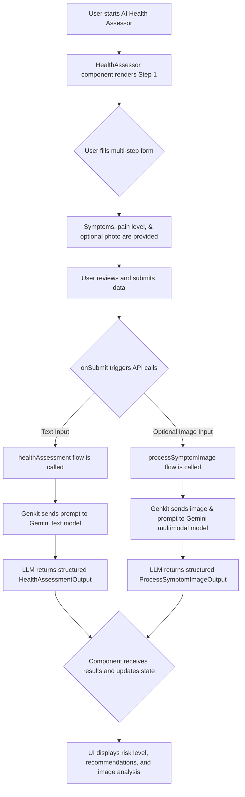

# AI Symptom Analyzer

### 1. Introduction
The AI Symptom Analyzer is a core feature of MediConnect, providing users with a preliminary health assessment based on their self-described symptoms. It leverages a powerful Large Language Model (LLM) through Google's Genkit framework to analyze user input and provide a structured response, including a risk level, assessment, and recommendation.

### 2. Integration in MediConnect
The feature is powered by a Genkit flow and integrated into a multi-step React component, providing a guided and user-friendly experience.

- **Genkit Flows**:
  - `health-assessment-flow.ts`: The primary backend logic that takes text-based user input (symptoms, age, gender, medical history) and returns a structured health analysis.
  - `process-symptom-image-flow.ts`: A secondary flow that handles image analysis. If a user uploads a photo of a visible symptom, this multimodal flow provides an additional layer of analysis.
- **Structured I/O with Zod**: Both flows use Zod schemas defined in `src/ai/schemas/health-assessment.ts` for their input and output. This ensures that the data sent to the LLM is well-defined and the response is reliably structured, preventing errors and simplifying UI integration.
- **Safety-First Prompt Engineering**: The prompts for both flows include strict instructions for the LLM to prioritize user safety. For example, it is directed to immediately classify emergency symptoms (like chest pain) and to always include a disclaimer advising users to consult a professional.
- **Frontend Component (`HealthAssessor.tsx`)**: The entire user interface is managed by the `HealthAssessor` component (`src/components/health-assessor/health-assessor.tsx`). It is a multi-step form that progressively collects user information:
    1.  **Step 1**: Basic demographics (age, gender, medical history).
    2.  **Step 2**: Main symptom description and an optional photo upload.
    3.  **Step 3**: A checklist of common symptoms, categorized for ease of use.
    4.  **Step 4**: A slider to indicate pain or discomfort level.
    5.  **Step 5**: A review screen to confirm all information before submission.
    6.  **Step 6**: The results view, which displays the AI's analysis.

### 3. Benefits
- **Accessibility**: Provides immediate, preliminary health information to users, which is especially valuable in areas where access to doctors is limited.
- **Structured Output**: Using Zod schemas with Genkit ensures the AI's response is predictable and can be easily parsed and displayed in a user-friendly format in the UI.
- **Triage Assistance**: Helps users understand the potential severity of their symptoms, guiding them to the appropriate level of care (e.g., monitor at home, schedule an appointment, or seek emergency help).
- **Safety Guardrails**: The system is explicitly designed to be cautious, defer to medical professionals, and highlight emergency situations, reducing the risk of misinterpretation.

### 4. Flowchart


### 5. Key Code Snippets
**Genkit Prompt Definition (`health-assessment-flow.ts`):**
```typescript
const prompt = ai.definePrompt({
  name: 'healthAssessmentPrompt',
  input: {schema: HealthAssessmentInputSchema},
  output: {schema: HealthAssessmentOutputSchema},
  prompt: `You are an AI medical assistant...
    **User Information:**
    - Symptoms: {{{symptoms}}}
    {{#if userContext}}
    - Age: {{userContext.age}}
    - Gender: {{userContext.gender}}
    {{/if}}
    **Your Task:**
    1.  **Assess Risk:** Classify the risk as 'Low', 'Medium', 'High', or 'Emergency'.
    2.  **Provide Assessment:** Briefly summarize possible implications...
    ...`,
});
```

**Calling the Flows from the Frontend (`HealthAssessor.tsx`):**
```javascript
// In onSubmit function
startTransition(async () => {
  const textInput: HealthAssessmentInput = { ... };
  const healthAssessmentResult = await healthAssessment(textInput);
  setTextResult(healthAssessmentResult);

  if (values.photo) {
    const imageAnalysisResult = await processSymptomImage({ ... });
    setImageResult(imageAnalysisResult);
  }
});
```

### 6. Testing Instructions
1.  **Emergency Symptom Test**: Enter symptoms indicative of a medical emergency, such as "severe chest pain and difficulty breathing." Verify that the AI result classifies the risk as "Emergency" and the primary recommendation is to contact local emergency services immediately.
2.  **Low-Risk Symptom Test**: Enter mild symptoms like "sneezing and a runny nose," with a low pain level. Verify the risk level is "Low" and the recommendation is to monitor at home.
3.  **Image Analysis Test**: Describe a "red, circular rash on my arm," select "Itching" from the checklist, and upload an image of a rash. Verify that the results include both the general health assessment and a separate, specific analysis of the image.
4.  **Multi-Step Form Validation**: Attempt to proceed through the form without filling out required fields on each step (e.g., leave age blank on Step 1). Verify that validation errors appear and prevent you from moving to the next step.
