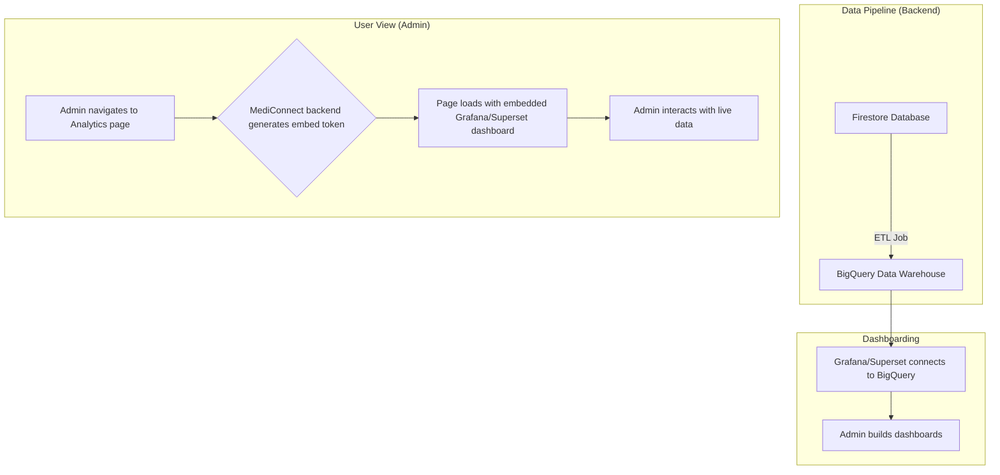

# Predictive Analytics (Grafana/Superset)

### 1. Introduction
To monitor platform health, user engagement, and health trends, MediConnect plans to integrate a powerful data visualization tool like Grafana or Apache Superset. These open-source platforms excel at creating real-time, interactive dashboards from various data sources.

### 2. Integration in MediConnect
This feature is conceptual, with the analytics dashboard in the app serving as a placeholder for the embedded visualization tool.

- **Data Source**: The primary data source would be a data warehouse (e.g., BigQuery) that aggregates data from our production Firestore database. A regular ETL (Extract, Transform, Load) job would transfer and anonymize relevant data.
- **Dashboarding Tool**: Grafana or Superset would connect to BigQuery. We would build dashboards to visualize key metrics.
- **Embedding**: The chosen tool provides options for embedding dashboards into other applications. We would embed the main analytics dashboard directly into the "Platform Analytics" page of the MediConnect admin suite.
- **Authentication**: Access to the embedded dashboard would be secured using JWT or a similar token-based authentication method, ensuring only authenticated admins can view the analytics.

### 3. Benefits
- **Real-time Insights**: Provides admins with up-to-the-minute insights into platform activity.
- **Data-Driven Decisions**: Helps identify which features are most used, where users are dropping off, and potential public health trends based on anonymized symptom data.
- **Customizable**: Both Grafana and Superset are highly customizable, allowing us to build tailored visualizations for our specific needs.
- **Scalable**: These tools are designed to handle large datasets, making them suitable for a growing platform.

### 4. Flowchart


### 5. Key Code Snippets
**Generating an Embed URL (Conceptual Backend Code):**
```javascript
// A conceptual backend endpoint for generating a secure embed URL
app.get('/api/analytics-embed-url', async (req, res) => {
  // 1. Verify user is an admin
  const user = await verifyUserIsAdmin(req.headers.authorization);
  if (!user) return res.status(403).send('Forbidden');

  // 2. Generate a signed embed token for Grafana/Superset
  const embedUrl = generateSignedEmbedUrl({
    user: user.id,
    dashboards: ['main-dashboard'],
    expiresIn: '10m',
  });

  res.json({ url: embedUrl });
});
```

### 6. Testing Instructions
This feature is conceptual in the current prototype. The Admin Analytics dashboard (`src/app/admin-dashboard/analytics/page.tsx`) is a mock-up of what the final embedded dashboard might look like.
1.  **UI Mockup**: Navigate to the admin dashboard and then to the "Platform Analytics" page. Verify that the mockup dashboard with charts and tables is displayed correctly.
2.  **Data Export**: Click the "Export CSV" button. Verify that a CSV file containing the mock audit log data is downloaded.
