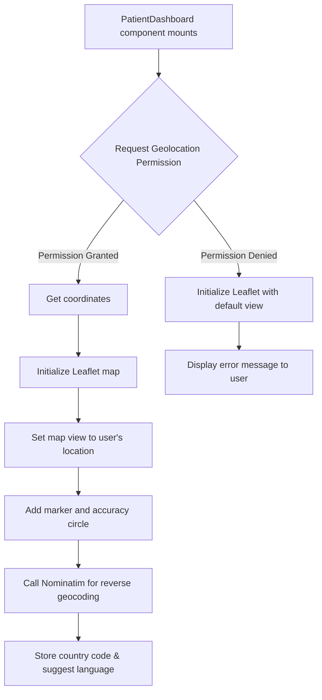

# Leaflet Mapping

### 1. Introduction
Leaflet is a leading open-source JavaScript library for mobile-friendly interactive maps. Weighing just about 42 KB of JS, it has all the mapping features most developers ever need. Leaflet is designed with simplicity, performance, and usability in mind.

### 2. Integration in MediConnect
Leaflet is integrated into the patient dashboard to provide location-based services, which are crucial for emergency response and suggesting localized services.

- **Dynamic Loading**: The Leaflet library and its CSS are loaded via a CDN in `src/app/layout.tsx` to keep the initial bundle size small.
- **Map Component**: The core integration happens in the `PatientDashboard` component (`src/components/dashboard/patient-dashboard.tsx`). It uses a `useEffect` hook to initialize the map within a `div` element.
- **Geolocation API**: The component utilizes the browser's `navigator.geolocation` API to request the user's live location. This is used to center the map and place a marker indicating their position.
- **Reverse Geocoding**: We use the Nominatim API to perform reverse geocoding. This converts the user's latitude and longitude into a country code, which is then used to power our language suggestion feature.
- **Fallback**: If location services are denied or fail, the map gracefully degrades by showing a default, zoomed-out view (e.g., centered on India) and displays an informative error message to the user.

### 3. Benefits
- **Lightweight**: Leaflet's small footprint ensures the dashboard loads quickly.
- **Open Source**: No licensing fees or vendor lock-in.
- **Interactive**: Provides a smooth, interactive map experience for the user.
- **Customizable**: Easily extendable with various plugins for features like heatmaps, markers, and more.

### 4. Flowchart


### 5. Key Code Snippets
**Initializing the Map in a React `useEffect` hook:**
```javascript
// In src/components/dashboard/patient-dashboard.tsx
useEffect(() => {
  // Ensure window.L is available from the CDN
  if (typeof window !== 'undefined' && window.L) {
    const map = window.L.map('map-div-id');
    
    L.tileLayer('https://{s}.tile.openstreetmap.org/{z}/{x}/{y}.png', {
      attribution: '© OpenStreetMap contributors'
    }).addTo(map);

    map.locate({ setView: true, maxZoom: 16 });

    map.on('locationfound', (e) => {
      // ... add marker, circle, and perform geocoding
    });

    map.on('locationerror', (e) => {
      // ... handle error and show default view
    });
  }
}, []);
```

### 6. Testing Instructions
1.  **Permission Grant**: Load the patient dashboard. When the browser prompts for location access, click "Allow." Verify the map centers on your current location with a marker.
2.  **Permission Deny**: Reload the page or use a new incognito window. When prompted for location access, click "Block." Verify the map shows a default, zoomed-out view and an error message is displayed below it.
3.  **Language Suggestion**: Using a VPN or browser location spoofer, set your location to Germany. Load the dashboard. Verify that a toast notification appears suggesting you switch the language to German.
