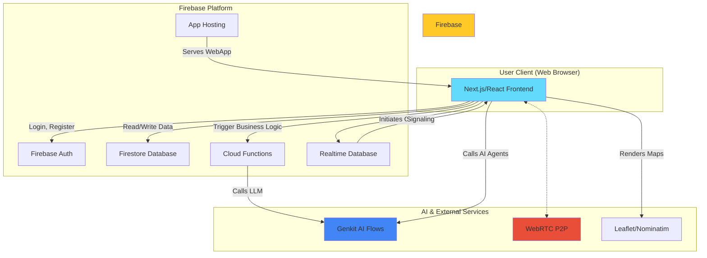
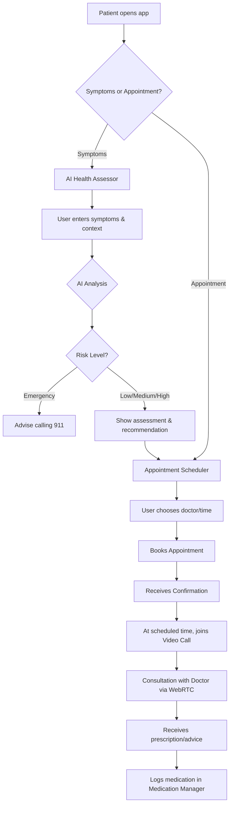
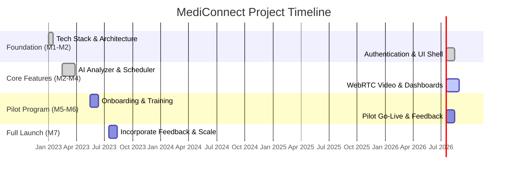

# MediConnect Visual Asset Guide

This document outlines key visual diagrams and infographics that help explain the MediConnect platform's architecture, user flow, and project plan. These visuals are intended for presentations, documentation, and onboarding new team members.

---

### 1. System Architecture Diagram

**Purpose**: To provide a high-level overview of the entire technical ecosystem, illustrating how different services and technologies interact.

**Content**: A block diagram showing the flow of data and commands between the user's client, our backend services, and third-party integrations.

---

### 2. User Journey Flowchart

**Purpose**: To trace a typical patient's journey from opening the app to completing a consultation, highlighting key decisions and interactions.

**Content**: A linear flowchart that shows the step-by-step process a user follows.

---

### 3. Geographic Coverage Map

**Purpose**: To visualize the real-world deployment area of the MediConnect pilot program.

**Implementation**: A screenshot or embedded view from a custom Leaflet map.
-   **Base Layer**: A map of the Nabha region in Punjab, India.
-   **Markers**:
    -   Blue markers for villages included in the pilot.
    -   Green cross markers for partner clinics.
    -   Red siren markers for designated emergency hubs or hospitals.
-   **Interactivity**: Clicking on a marker would show a popup with the location's name and services available.

---

### 4. Timeline / Gantt Chart

**Purpose**: To communicate the project's schedule, phases, and key deliverables to stakeholders.

**Implementation**: A Gantt chart created with Mermaid.

---

### 5. Technical Stack Infographic

**Purpose**: A quick, visual summary of the key technologies used in the project.

**Implementation**: A 2x3 grid of high-resolution logos. Each logo has a one-line caption beneath it.
-   **React**: Powering the user interface.
-   **Firebase**: For authentication, database, and backend functions.
-   **WebRTC**: Enabling secure, peer-to-peer video consultations.
-   **Leaflet**: For interactive maps and location services.
-   **Rocket.Chat**: For secure, scalable community messaging.
-   **Grafana/Superset**: For visualizing platform analytics and health trends.

---

### 6. Security & Compliance Overview

**Purpose**: To illustrate the project's commitment to data privacy and security in a single, digestible graphic.

**Implementation**: A central, large shield icon. Annotations point from the shield to key security features:
-   **Firebase Security Rules**: "Granular, rule-based access control for Firestore."
-   **Custom Claims (JWT)**: "Role-based access enforced at the token level."
-   **HIPAA-Ready Chat**: "End-to-end encryption available for all user communications."
-   **Encrypted Storage**: "All sensitive user data is encrypted at rest."

---

### 7. Performance Metrics Snapshot

**Purpose**: To provide quantitative proof of the application's responsiveness and efficiency.

**Implementation**: A simple dashboard-style card with three key metrics, each with a radial chart or a simple bar.
-   **Average Page Load Time**: `< 2s`
-   **Video Connection Time**: `< 5s`
-   **AI Analysis Response Time**: `< 3s`
