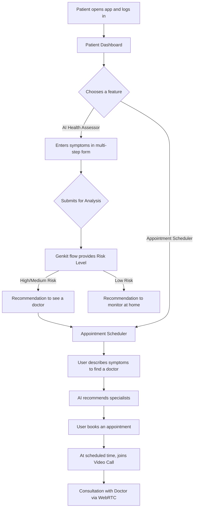
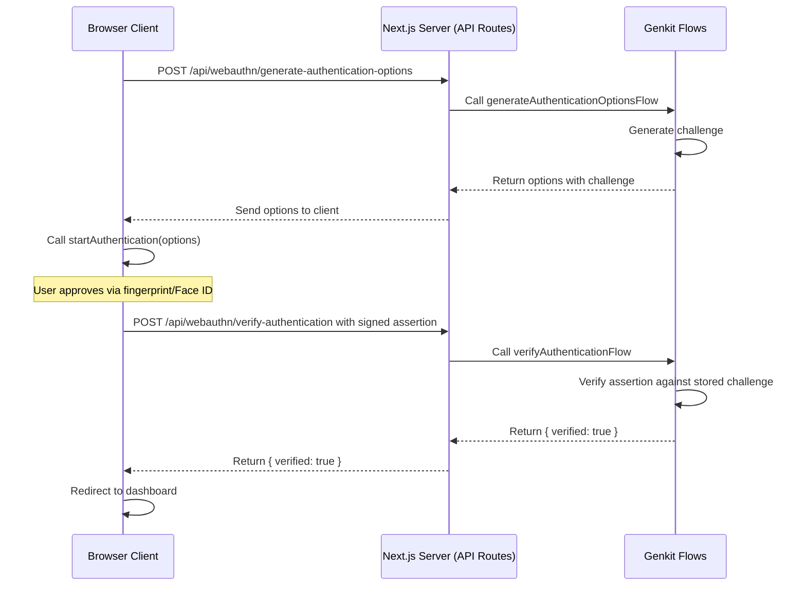

# MediConnect Visual Asset Guide

This document outlines key visual diagrams and infographics that help explain the MediConnect platform's architecture, user flow, and technology stack. These visuals are intended for documentation, presentations, and onboarding new team members.

---

### 1. System Architecture Diagram

**Purpose**: To provide a high-level overview of the entire technical ecosystem, illustrating how different services and technologies interact.

**Content**: A block diagram showing the flow of data and commands between the user's client, our backend services, and third-party integrations.

```mermaid
graph TD
    subgraph "User Client (Browser)"
        WebApp[Next.js / React Frontend]
    end

    subgraph "Backend & AI Services"
        Genkit[Genkit AI Flows</br>(Gemini, TTS)]
        Firebase[Firebase Platform]
    end
    
    subgraph "Firebase Services Used"
        Auth[Firebase Auth</br>(for concept)]
        RTDB[Realtime Database</br>(for WebRTC Signaling)]
    end

    subgraph "External APIs & Libraries"
        WebRTC[WebRTC P2P Library]
        Maps[Leaflet / Nominatim]
        i18n[i18next]
    end
    
    WebApp -- "Login/Register (Mock)" --> Auth
    WebApp -- "AI analysis, TTS" --> Genkit
    
    WebApp -- "Initiates Call" --> RTDB
    RTDB -- "Signaling Metadata" --> WebApp
    WebApp <-.->|"Direct Media Stream"| WebRTC
    
    WebApp -- "Renders Interactive Maps" --> Maps
    WebApp -- "Handles UI Translations" --> i18n

    style WebApp fill:#61DAFB
    style Firebase fill:#FFCA28
    style Genkit fill:#4285F4
    style WebRTC fill:#e94e39
```

---

### 2. User Journey Flowchart (Patient)

**Purpose**: To trace a typical patient's journey from opening the app to completing a key action, highlighting decisions and feature interactions.

**Content**: A flowchart that shows the step-by-step process a patient follows to get a health assessment and book an appointment.



---

### 3. Technology Stack Infographic

**Purpose**: A quick, visual summary of the key technologies used in the project, suitable for presentations.

| Logo | Technology | Description |
| :--- | :--- | :--- |
| **Next.js** | **Web Framework** | Powers the server-centric application with its App Router and React Server Components. |
| **React** | **UI Library** | Used to build the entire user interface with a component-based architecture. |
| **Tailwind CSS** | **CSS Framework** | Provides utility-first classes for all styling, enabling rapid and consistent design. |
| **ShadCN UI** | **Component Library** | A set of accessible and reusable UI components built on Radix UI and Tailwind. |
| **Genkit** | **AI Framework** | Orchestrates calls to Google's Gemini models for all AI features. |
| **Firebase** | **Backend Services** | Used for user authentication concepts and as a real-time signaling server for WebRTC. |
| **WebRTC** | **P2P Communication** | Enables secure, low-latency, peer-to-peer video consultations directly in the browser. |
| **Leaflet** | **Mapping Library** | An open-source library for interactive maps, used for the live location feature. |
| **i18next** | **I18n Framework** | Manages the translation of the application into multiple languages. |

---

### 4. Security & Authentication Flow (WebAuthn)

**Purpose**: To illustrate the secure, passwordless login flow using WebAuthn (passkeys).

**Content**: A sequence diagram showing the interaction between the client, the Next.js server, and the browser's credential manager.


