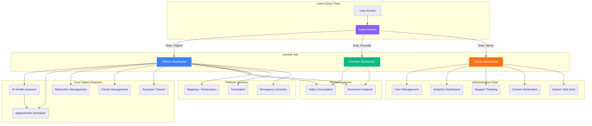

# MediConnect Feature Architecture

This document provides a comprehensive overview of the features within the MediConnect platform, detailing how they function and interconnect to create a cohesive and powerful telemedicine application.

---

## 1. Core Concept: An Interconnected Ecosystem

MediConnect is not just a collection of standalone tools; it's a deeply integrated ecosystem where each feature supports and enhances the others. The flow of information and user context is central to its design. The journey begins with **Authentication**, which acts as the gatekeeper and role-definer. This role then dictates the user's experience, starting with a personalized **Role-Based Dashboard** that serves as the command center for accessing every other relevant feature.

---

## 2. Feature Breakdown and Interconnections

### **A. Authentication (`/login`, `/register`, `/forgot-password`)**
- **Purpose**: To securely verify a user's identity and determine their role (Patient, Provider, or Admin). It supports email/password, phone OTP, and biometric (WebAuthn) methods. Includes accessibility features like text-to-speech for password reset.
- **Connections**:
    - **Role-Based Dashboards**: This is the most critical connection. After successful login, Authentication sets the user's role, which immediately directs them to the appropriate dashboard.
    - **All Other Features**: By establishing an authenticated session, this feature grants access to all other parts of the platform.
    - **Genkit Flows**: The WebAuthn logic is powered by specific Genkit flows that handle cryptographic challenges and verification. The password reset voice assistance uses a text-to-speech flow.

### **B. Role-Based Dashboards (`/patient-dashboard`, `/provider-dashboard`, `/admin-dashboard`)**
- **Purpose**: To provide a personalized home page for each user type, presenting a curated set of feature cards relevant to their needs.
- **Connections**:
    - **Authentication**: Receives the user's role from the authentication process to render the correct dashboard.
    - **All Other Features**: The dashboard cards are the primary navigation method, acting as gateways that link the user to every other feature.

### **C. AI Health Assessor (`/ai-health-assessor`)**
- **Purpose**: A multi-step form that provides a preliminary health assessment using a Genkit-powered LLM, including optional image analysis.
- **Connections**:
    - **Appointment Scheduler**: A user can seamlessly move from getting an AI assessment to booking an appointment. The symptoms and risk level can pre-populate the scheduler.
    - **Emergency Response**: If the analyzer detects 'Emergency' risk, it directly integrates with the emergency protocol by advising the user to contact local services.
    - **Genkit**: Uses `health-assessment-flow` for text analysis and `process-symptom-image-flow` for image analysis.

### **D. Appointment Scheduler (`/appointments`)**
- **Purpose**: An AI-enhanced system for finding and booking appointments based on symptoms.
- **Connections**:
    - **AI Symptom Analyzer**: Can use symptom data from the analyzer to recommend relevant doctor specialties.
    - **Video Consultation**: A successfully booked video appointment directly leads to the creation of a WebRTC session at the scheduled time.
    - **Provider Dashboard**: Upcoming appointments for a provider are displayed on their dashboard.
    - **Genkit**: The `find-doctor-flow` is used to intelligently suggest specialists.

### **E. Video Consultation (`/video-consultation`)**
- **Purpose**: Secure, real-time, peer-to-peer video calls using WebRTC.
- **Connections**:
    - **Appointment Scheduler**: The scheduler can generate the unique room ID that both patient and provider use to join the call.
    - **Provider & Patient Dashboards**: Both users can initiate or join scheduled calls directly from their dashboards.
    - **Firebase (Realtime Database)**: Used as the signaling server to exchange metadata (offers, answers, ICE candidates) needed to establish the WebRTC connection.

### **F. Document Analyzer (`/document-analyzer`)**
- **Purpose**: Allows users (patients or providers) to upload medical documents (prescriptions, lab reports) and ask specific questions, which are answered by a multimodal Genkit flow.
- **Connections**:
    - **Genkit**: Powered by the `analyze-documents-flow`, which uses a multimodal model to read text and interpret images within documents.
    - **Role-Based Access**: The UI adapts for providers, allowing them to select a patient for whom they are analyzing documents.

### **G. Medication, Family, and Symptom Management (`/medications`, `/family`, `/symptom-tracker`)**
- **Purpose**: These are patient-centric, client-side features for managing personal health data.
- **Connections**:
    - **Patient Dashboard**: All are accessed directly from the patient's main dashboard.
    - **(Future) Provider Access**: In a future iteration, a patient could grant a provider or family member permission to view their medication list or symptom history.
    - **Symptom Tracker**: Integrates an AI image analysis flow (`process-symptom-image-flow`) for visual symptoms.

### **H. Mapping & Emergency Response**
- **Purpose**: The `Leaflet` integration provides live geolocation, which is a cornerstone of the emergency features displayed on the patient dashboard.
- **Connections**:
    - **Patient Dashboard**: The live map and emergency contact list are displayed directly on the patient's dashboard for quick access.
    - **Translation (i18next)**: The reverse geocoding performed by the map (turning coordinates into a country) is used to proactively suggest a language switch to the user, directly connecting the mapping service to the i18n system.

### **I. Admin Suite (`/admin-dashboard/*`)**
- **Purpose**: A comprehensive set of tools for platform administration, strictly limited to users with the 'admin' role.
- **Connections**:
    - **User Management (`/users`)**: A table-based interface to view, filter, sort, and manage all platform users, including changing roles and verifying accounts.
    - **Platform Analytics (`/analytics`)**: A mock dashboard (simulating Grafana/Superset) using `recharts` to display key platform metrics like user growth and feature engagement.
    - **Content Moderation (`/moderation`)**: A queue-based interface for reviewing user-generated content, such as reported chat messages or AI analyses flagged for human oversight.
    - **Support Ticketing (`/support`)**: The admin view for the support ticket system. It uses a mock in-memory store (`ticket-store.ts`) and a reactive table to display, filter, and update ticket statuses.
    - **System Test Suite (`/test-suite`)**: An interactive page that simulates running a suite of automated tests against platform services, providing a quick way to check system health.
