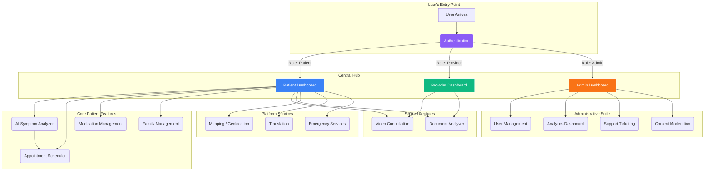

# MediConnect Feature Architecture

This document provides a comprehensive overview of the features within the MediConnect platform, detailing how they function and interconnect to create a cohesive and powerful telemedicine application.

---

## 1. Core Concept: An Interconnected Ecosystem

MediConnect is not just a collection of standalone tools; it's a deeply integrated ecosystem where each feature supports and enhances the others. The flow of information and user context is central to its design. The journey begins with **Authentication**, which acts as the gatekeeper and role-definer. This role then dictates the user's experience, starting with a personalized **Role-Based Dashboard** that serves as the command center for accessing every other relevant feature.

---

## 2. Feature Breakdown and Interconnections

### **A. Authentication (`/login`, `/register`)**
- **Purpose**: To securely verify a user's identity and determine their role (Patient, Provider, or Admin). It supports email/password, OTP, and biometric (WebAuthn) methods.
- **Connections**:
    - **Role-Based Dashboards**: This is the most critical connection. After successful login, Authentication sets the user's role, which immediately directs them to the appropriate dashboard.
    - **All Other Features**: By establishing an authenticated session, this feature grants access to all other parts of the platform. Without it, users are restricted to public pages.
    - **Genkit Flows**: The WebAuthn logic is powered by specific Genkit flows that handle cryptographic challenges and verification.

### **B. Role-Based Dashboards (`/patient-dashboard`, etc.)**
- **Purpose**: To provide a personalized home page for each user type, presenting a curated set of feature cards relevant to their needs.
- **Connections**:
    - **Authentication**: Receives the user's role from the authentication process to render the correct dashboard.
    - **All Other Features**: The dashboard cards are the primary navigation method, acting as gateways that link the user to every other feature, such as the `AI Health Assessor`, `Appointment Scheduler`, and `Admin Suite`.

### **C. AI Symptom Analyzer (`/ai-health-assessor`)**
- **Purpose**: Provides a preliminary health assessment using a Genkit-powered LLM.
- **Connections**:
    - **Appointment Scheduler**: A user can seamlessly move from getting an AI assessment to booking an appointment. The symptoms and risk level identified by the analyzer can pre-populate the scheduler, helping to find the right specialist.
    - **Emergency Response**: If the analyzer detects 'Emergency' risk, it directly integrates with the emergency protocol by advising the user to contact local services, reinforcing the connection to the Emergency Response feature.

### **D. Appointment Scheduler (`/appointments`)**
- **Purpose**: An AI-enhanced system for finding and booking appointments.
- **Connections**:
    - **AI Symptom Analyzer**: Uses symptom data from the analyzer to recommend relevant doctor specialties.
    - **Video Consultation**: A successfully booked video appointment directly leads to the creation of a WebRTC session at the scheduled time. The appointment confirmation contains the necessary details to join the call.
    - **Provider Dashboard**: Upcoming appointments are displayed prominently on the provider's dashboard, forming their daily patient queue.

### **E. Video Consultation (`/video-consultation`)**
- **Purpose**: Secure, real-time, peer-to-peer video calls using WebRTC.
- **Connections**:
    - **Appointment Scheduler**: This feature is the entry point for most video calls. The scheduler generates the unique room ID that both patient and provider use to join the call.
    - **Provider & Patient Dashboards**: Both users can initiate or join scheduled calls directly from their dashboards.
    - **Firebase (Realtime Database)**: Used as the signaling server to exchange metadata (offers, answers, ICE candidates) needed to establish the WebRTC connection.

### **F. Medication & Family Management (`/medications`, `/family`)**
- **Purpose**: These are patient-centric features for managing personal health data.
- **Connections**:
    - **Patient Dashboard**: Both are accessed directly from the patient's main dashboard.
    - **(Future) Provider Access**: In a future iteration, a patient could grant a provider or family member permission to view their medication list, creating a connection between these features and the provider's view.

### **G. Mapping & Emergency Response**
- **Purpose**: The `Leaflet` integration provides live geolocation, which is a cornerstone of the emergency features.
- **Connections**:
    - **Patient Dashboard**: The live map and emergency contact list are displayed directly on the patient's dashboard for quick access.
    - **Translation (i18next)**: The reverse geocoding performed by the map (turning coordinates into a country) is used to proactively suggest a language switch to the user, directly connecting the mapping service to the i18n system.

### **H. Admin Suite (`/admin-dashboard/*`)**
- **Purpose**: A collection of tools for platform administration.
- **Connections**:
    - **Authentication**: Access is strictly limited to users with the 'admin' role.
    - **Support Ticketing**: The admin dashboard contains the interface for viewing, managing, and responding to all user-submitted support tickets.
    - **User Management**: The user management tool directly interacts with the platform's user data (mocked, but would be Firestore), allowing admins to change roles—a change that would be immediately reflected the next time a user logs in or their token is refreshed.
    - **Predictive Analytics**: The analytics dashboard (a mockup of Grafana/Superset) would connect to the production database to visualize user activity, feature engagement, and health trends, providing vital insights for platform management.
